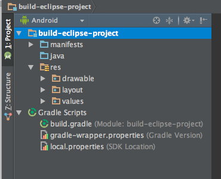
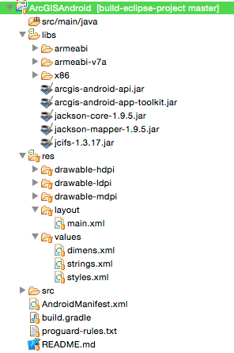

# Build ArcGIS Android Eclipse project with Gradle
A gradle build project structure to retain Eclipse compatibility after migrating ArcGIS Android SDK projects to Android Studio.

# Developer Instructions

## Fork the repo
If you haven't already, fork the [this repo](https://github.com/Esri/gradle-eclipse-studio-android/fork).

## Clone the repo
### Command line Git
[Clone the Gradle Eclipse Studio Android repo](https://help.github.com/articles/fork-a-repo#step-2-clone-your-fork)

Open your terminal, navigate to your working directory, use ```git clone``` to get a copy of the repo.

```bash
# Clones your fork of the repository into the current directory in terminal
$ git clone https://github.com/YOUR-USERNAME/gradle-eclipse-studio-android.git
```

## Build Script explained
### Eclipse configuration
First we configure the classpath file.  In generating we add entries for Android Gradle based source location as shown below:  

```groovy
// Configuring Eclipse classpath
eclipse.classpath.file {


  // Direct manipulation of the generated classpath XML
  withXml {

    // Since non-default source directories are used
    // they need to be manually added to the classpath XML
    def node = it.asNode()

    // Main source directory
    node.appendNode('classpathentry kind="src" path="src/main/java"')

    // Generated code directory
    node.appendNode('classpathentry kind="src" path="gen"')

  }

}
```

Then we configure the Eclipse project.  The project name can be changed to the name you will see in the Eclipse project explorer.  Then we set the Android nature and builders to let Eclipse know that this is an Android Project.  

```groovy
// Configuring Eclipse project
eclipse.project {
  // Project name that will appear in your project explorer
  name = 'ArcGISAndroid'

  // Letting Eclipse know that the project is Android
  natures 'com.android.ide.eclipse.adt.AndroidNature'
  buildCommand 'com.android.ide.eclipse.adt.ResourceManagerBuilder'
  buildCommand 'com.android.ide.eclipse.adt.PreCompilerBuilder'
  buildCommand 'com.android.ide.eclipse.adt.ApkBuilder'
}
```

## Project Structure
File structure has changed for Gradle based Android Studio projects.  Eclipse is more restrictive than Android Studio as you can use Gradle to work with almost any file structure you describe in the source sets of the build script.  Here are the artifacts that Eclipse will not let you move:  

* AndroidManifext.xml
* res/
* assets/

So we define them separately in the build script.  

```groovy
sourceSets {
  main {
    manifest.srcFile 'AndroidManifest.xml'
    res.srcDirs = ['res']
    assets.srcDirs = ['assets']
  }
```

## Usage
Now that you have set up the repo project and contextualized the gradle build script (build.gradle) you can generate projects with cross-IDE compatibility between Eclipse and Android Studio based on the gradle build tool.  Use this command to setup Eclipse project.

```
$ gradle cleanEclipse eclipse --info
```

This build command will set up projects with a HelloWorld source template to customize your app project of which you can now open in Eclipse or Android Studio all while managing the project with Gradle.

## Open project in Eclipse or Android Studio
You can now open the project in Eclipse or import into Android Studio.

### Android Studio Project



### Eclipse project



## Issues
Find a bug or want to request a new feature enhancement?  Let us know by submitting an issue.

## Contributing
Anyone and everyone is welcome to [contribute](https://github.com/Esri/maps-app-android/blob/master/CONTRIBUTING.md). We do accept pull requests.

1. Get involved
2. Report issues
3. Contribute code
4. Improve documentation

## Licensing
Copyright 2015 Esri

Licensed under the Apache License, Version 2.0 (the "License"); you may not use this file except in compliance with the License. You may obtain a copy of the License at

http://www.apache.org/licenses/LICENSE-2.0

Unless required by applicable law or agreed to in writing, software distributed under the License is distributed on an "AS IS" BASIS, WITHOUT WARRANTIES OR CONDITIONS OF ANY KIND, either express or implied. See the License for the specific language governing permissions and limitations under the License.

A copy of the license is available in the repository's [license.txt](https://github.com/Esri/maps-app-android/blob/master/license.txt) file.

For information about licensing your deployed app, see [License your app](https://developers.arcgis.com/android/guide/license-your-app.htm).

[](Esri Tags: ArcGIS Android Mobile)
[](Esri Language: Java)​
